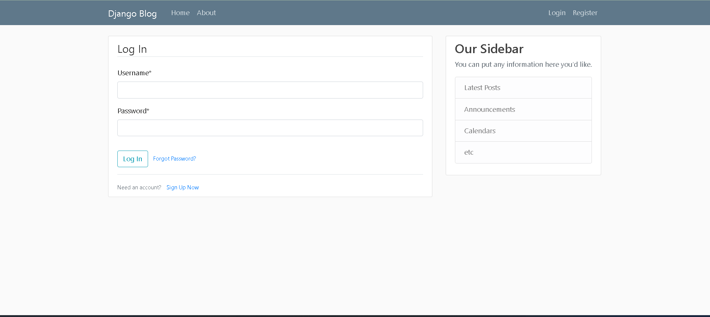
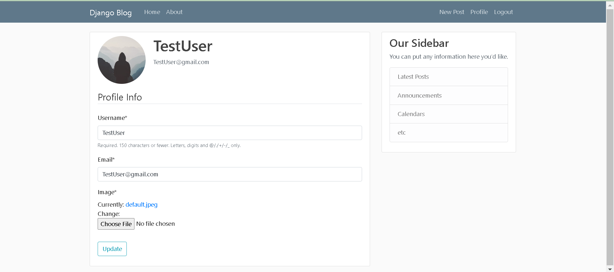

# Django Blog Application

This is a simple blog application built using the Django web framework. It allows users to create, update, and delete posts as well as manage their profile details.

## Installation

1. Clone the repository:

   ```
   git clone https://github.com/GowthamiRadha/BlogProject.git
   cd BlogProject
   ```

2. Create and activate a virtual environment:

   ```
   virtualenv env
   source env/bin/activate
   ```

3. Install the dependencies:

   ```
   pip install -r requirements.txt
   ```

4. Set up Google App Passwords:

   In order to send email notifications, you will need to set up Google App Passwords. Follow these steps:

   - Go to https://myaccount.google.com/security.
   - Click on "App Passwords" under "Signing in to Google".
   - Select "Mail" and "Other (Custom name)".
   - Enter "Django Blog" as the custom name.
   - Click "Generate".
   - Copy the generated password.

5. Set the following environment variables which will be used to Send Email Notification for Reset Password:

   ```
   DJANGO_EMAIL_HOST_USER="your-email-address"
   DJANGO_EMAIL_HOST_PASSWORD="your-app-password"
   ```
   
   Replace `your-email-address` with the email address you want to use to send notifications.

   Replace `your-app-password` with the Google App Password you generated in step 4.


6. Migrate the database:

   ```
   python mange.py makemigrations
   python manage.py migrate
   ```

7. Create a superuser:

   ```
   python manage.py createsuperuser
   ```

8. Run the development server:

   ```
   python manage.py runserver
   ```

   The application should now be running at http://127.0.0.1:8000/

## Usage

### User Authentication

The Django Blog Application includes built-in user authentication features that allow users to register, log in, and log out of their accounts.

To access these features, look for the following links in the navigation bar:

- **Register:** Click on the "Register" link to create a new account. Fill out the registration form with your desired username, email address, and password.

- **Login:** Click on the "Login" link to access your account. Enter your username and password on the login form.

- **Logout:** Click on the "Logout" link to log out of your account. This will end your session and redirect you to the home page.

You can also use the following URLs to access these features:

- `/register/`: Use this URL to register a new account.

- `/login/`: Use this URL to log in to your account.

- `/logout/`: Use this URL to log out of your account.

### Password Reset

1. If you forget your password, select "Forgot Password?" option and enter your email address. You will receive an email with a link to reset your password.



### User Profile

1. To view or update your profile information, go to the "Profile" page. You can update your username, email address, and Profile picture.



### Blog Posts

The main functionality of the Django Blog Application is to create, update, and delete blog posts.

1. To view a list of all blog posts, go to the home page. Here, you can view a list of all blog posts that have been created.

2. To view the details of a specific blog post, click on the post title. This will take you to a detailed view of the post, where you can read the full content.

3. To create a new blog post, you must be logged in to your account. Click on the "New Post" link in the navigation bar and fill out the post form. Once you have created a post, it will be added to the list of posts on the home page.

4. To update an existing blog post, you must be logged in to the account that created the post. Navigate to the post detail page and click on the "Edit" button. You can update the post title and content.

5. To delete an existing blog post, you must be logged in to the account that created the post. Navigate to the post detail page and click on the "Delete" button. This will permanently remove the post from the database.

6. You can also view a list of all posts created by a specific user by clicking on their username. This will take you to a page with a list of all the posts they have created.

## Contributing

Contributions are welcome! If you would like to contribute to this project, please follow these steps:

1. Fork the repository.

2. Create a new branch:

   ```
   git checkout -b my-new-feature
   ```

3. Make your changes and commit them:

   ```
   git commit -am 'Add some feature'
   ```

4. Push to the branch:

   ```
   git push origin my-new-feature
   ```

5. Submit a pull request.